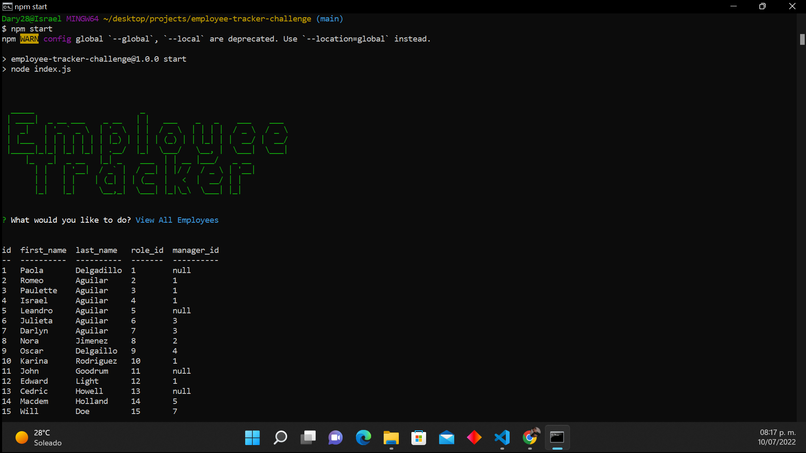

# Employee Tracker

[](https://github.com/israel2800)
[](https://github.com/israel2800/employee-tracker-challenge)
[](https://github.com/israel2800/employee-tracker-challenge)
[](https://nodejs.org/en/)
[](https://www.npmjs.com/package/inquirer)
[](https://choosealicense.com/licenses/mit/)

## Table of Content
* [ Project Links ](#Project-Links)
* [ Screenshots-Demo ](#Screenshots)
* [ Project Objective ](#Project-Objective)
* [ User Story ](#User-Story)
* [ Technologies ](#Technologies)
* [ Installation ](#Installation)
* [ Usage ](#Usage)
* [ Credits and Reference ](#Credits-and-Reference)
* [ Tests ](#Tests)
* [ Author Contact ](#Author-Contact)
* [ License ](#License)
#

##  Project Links
YouTube video Demo:
https://youtu.be/j7dc3ZQ_NK0

GitHub project:
https://github.com/Israel2800/employee-tracker


## Screenshots-Demo


## Project Objective
Create an application that allows a company to manage their employees and departments by adding, updating, viewing and deleting the required information such as the name of the employees, their role and also if they have a manager. The command line will display a table and the information in this table will depend on the option the user chooses.

## User Story
AS a business owner, I WANT to be able to view and manage the departments, roles, and employees in my company, SO THAT I can organize and plan my business.

## Technologies 
```
node.js, npm inquirer, JavaScript, mysql2, figlet, terminal-kit
```

## Installation
Access to the GitHub project and clone or download the project, you can do this by clicking in the green button with the word "Code". If you decided to clone the repo you need to choose one of the SSH/HTTPS keys and copy one, after this you will need to open the terminal of your choice and type "git clone 'key'" you will need to paste one of the two keys you previously select and then click enter. If you decided to download the project you will click in the "Download.zip" option and the project will be downloaded so you will locate the file and do a right-click to select "Extract All" and you can choose where tu place it.

## Usage 
To use this app you will need to download and install the terminal for mac or gitbash for windows. You may also need to install [node.js](https://nodejs.org/en/) and [npm](https://www.npmjs.com/) using the terminal. You will open the project in the code editor of your choice and then open the terminal and type "npm install" or "npm i" to install all the dependencies required. Finally you will be able to start the app typing "npm start" or "node index.js" on your terminal or gitbash.

## Credits and Reference
The following link helped me with the project: https://github.com/sidorares/node-mysql2

## Tests
npm test

## Author Contact
Contact the author with any questions!<br>
Github link: [Israel2800](https://github.com/israel2800)<br>
Email: dady281100@gmail.com

## License
This project is [MIT](https://choosealicense.com/licenses/mit/) licensed.<br />

Copyright © 2022 [ISRAEL AGUILAR](https://github.com/israel2800)

<hr>
<p align='center'><i>
This README was generated with ❤️ by ISRAEL AGUILAR
</i></p>
